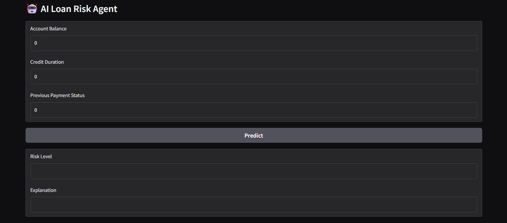

# 🤖 AI Loan Risk Agent

An end-to-end machine learning project that predicts loan repayment risk and provides AI-style explanations.

The project includes data analysis, model training, and deployment as an interactive web application.

## 🚀 Live Demo

👉 Hugging Face App: https://huggingface.co/spaces/beyzauzun/ai-loan-risk-agent

## 📎Kaggle Notebook

👉 https://www.kaggle.com/code/beyzauzun97/ai-loan-risk-prediction-final-version


## 📸 App Preview

<p align="center">
  
</p>


## 🚀 Features
- Predicts loan repayment risk (High Risk / Low Risk)
- Uses Random Forest Classifier
- Provides simple human-readable explanations
- Interactive UI with Gradio
- Deployed on Hugging Face Spaces

⸻

## 💡 Project Overview

This project predicts whether a customer is **creditworthy or high risk** using financial data.

It includes:
- Data preprocessing
- Feature selection
- Model training (Random Forest)
- Model deployment with Gradio
- Real-time prediction interface

⸻
  
## 📊 Model Performance

- Accuracy: 77%
- Model: Random Forest Classifier
- Task: Binary Classification (Credit Risk)

Confusion Matrix:
[[31 31]
 [15 123]]
 
⸻

## 🛠️ Tech Stack

- Python
- Pandas
- Scikit-learn
- Gradio
- Hugging Face Spaces
- Kaggle

⸻
  
## ⚙️ How to Run

```bash
pip install -r requirements.txt
python app.py
```
⸻

📌 Example Input

* Account Balance: 1
* Credit Duration: 18
* Previous Payment Status: 4

📊 Output

* Risk Level: High Risk
* Explanation: Customer may default

⸻

## 🚀 Project Highlights

- End-to-end ML pipeline (data → model → deployment)
- Interactive web app for real-time predictions
- AI-style explanation system
- Deployed on Hugging Face Spaces
  
⸻

💡 Future Improvements

* Add more features for better accuracy
* Improve explanation system (LLM integration)
* Build full AI agent workflow

⸻

👩‍💻 Author

Beyza Uzun
